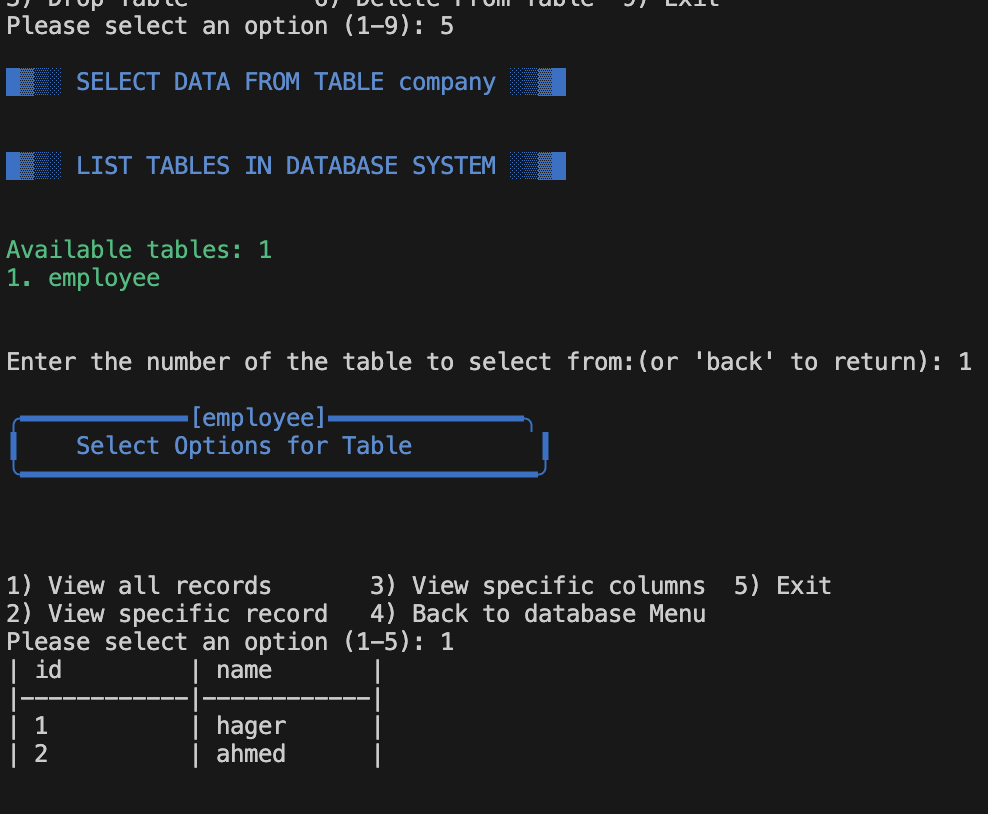

---
# Simple Bash-Based Database Management System (DBMS)

A command-line interface (CLI) based DBMS implemented in Bash scripting language.  
It allows users to manage databases and tables using file-based storage on the disk.

## Project Overview

This system provides support for multiple databases and tables.  
Each database is stored as a directory, and each table is stored as two files:
- `.meta` file for schema
- `.data` file for the records

## Features

### Main Menu
- Create Database
- List Databases
- Connect to Database
- Drop Database

### Database Menu
- Create Table
- List Tables
- Drop Table
- Insert into Table
- Select from Table
- Delete from Table
- Update Table

### Additional
- Primary Key support
- Data type validation (int, string, boolean)
- Error handling and input validation
- Formatted CLI display

## System Structure

```
├── main.sh
├── menu.sh
├── DBmenu.sh
├── DBmenu2.sh
├── validation.sh
└── dbms_data/
    ├── database1/
    │   ├── table1.meta
    │   └── table1.data
    └── database2/
```

## Installation

1. Clone the repository:
```bash
git clone https://github.com/Hager706/bash-project-DBMS.git
cd bash-project-DBMS
```

2. Make all scripts executable:
```bash
chmod +x main.sh menu.sh DBmenu.sh DBmenu2.sh validation.sh
```

3. Run the application:
```bash
./main.sh
```

## Example Workflow

1. Create database  
   

2. Connect to database  
   

3. Create table  
   

4. Insert record  
   

5. Select from table  
   

## Supported Data Types

| Data Type | Example       | Notes                              |
|-----------|---------------|------------------------------------|
| int       | 100, -5        | Only integers allowed              |
| string    | "John", "abc" | Max 100 chars, no special chars    |
| boolean   | true, false   | Case-insensitive, 1 or 0 accepted  |

## File Formats

### Meta File (.meta)
```
column_name:data_type:constraint
id:int:PRIMARY_KEY
name:string:NONE
salary:int:NONE
```

### Data File (.data)
```
id:name:salary
1:John Doe:50000
2:Jane Smith:60000
```

## Data Validation

- Primary key must be unique
- Column names must be valid
- Data types are enforced
- Input is sanitized to prevent injection

## Project Information

**Created by**: Hager Tarek  
**Course**: Bash Scripting  